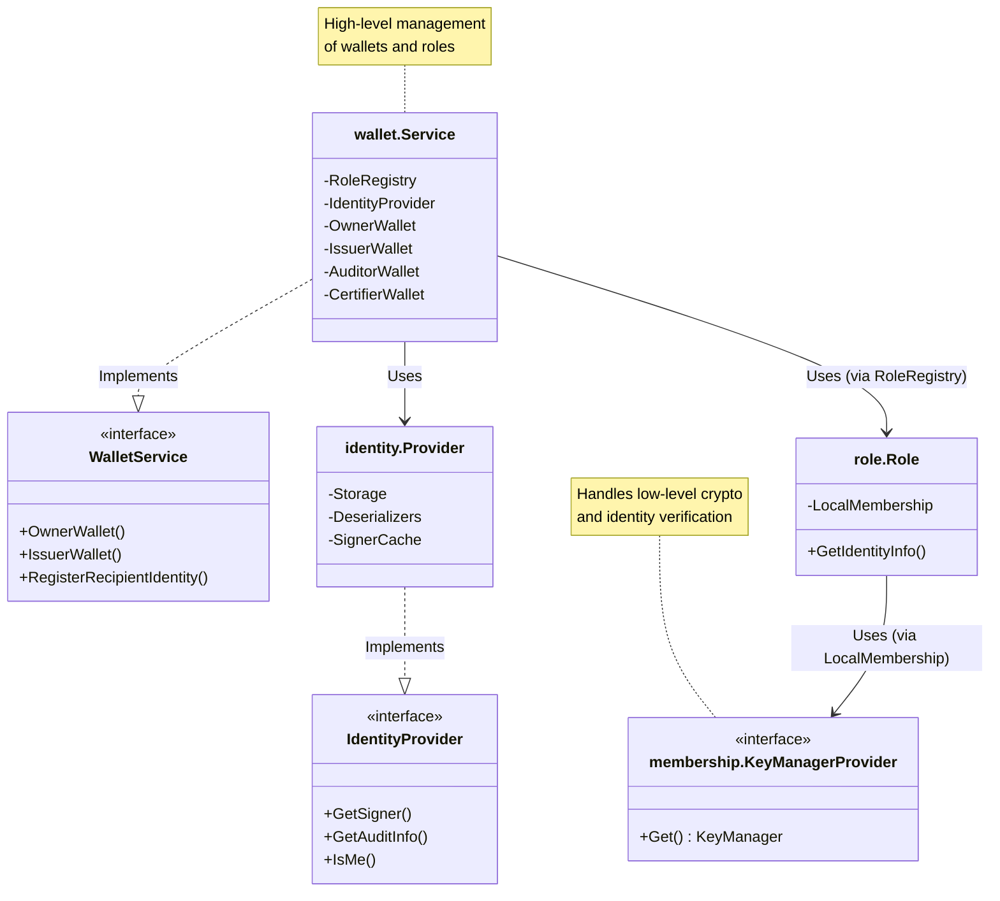

# Identity Service

The **Identity Service** (`token/services/identity`) is an **internal infrastructure service** of Panurus. It provides a unified interface for managing identities, signatures, and verification, operating **independently** of the core Fabric Smart Client (FSC) identity service. 

This independence ensures that token-related cryptographic material (such as Idemix pseudonyms or X.509 certificates used for token ownership) is managed according to the specific privacy and security requirements of the Token Drivers, regardless of the underlying DLT platform.

## Overview

The Identity Service abstracts the complexity of different cryptographic schemes, allowing Panurus to support multiple identity types (e.g., X.509, Idemix) and different storage backends seamlessly. 

It is a fundamental component used by token drivers and application services (like the TTX service) to handle:
*   **Signature Management**: Generating and verifying signatures for token requests.
*   **Identity Resolution**: Resolving long-term identities to ephemeral pseudonyms and vice-versa.
*   **Auditability**: Managing audit information to reveal the enrollment ID behind an anonymous identity (when authorized).
*   **Wallet Management**: Handling identities for different roles such as Issuer, Auditor, Owner, and Certifier.

## Architecture

The Identity Service implements the **Driver API** interfaces defined in `token/driver/wallet.go`. This ensures that the Token Management System (TMS) can interact with any identity implementation through a standard set of methods.

### Component Mapping

The following table shows how the internal components map to the Driver API interfaces:

| Component              | Implements Driver Interface | Description                                           |
|:-----------------------|:----------------------------|:------------------------------------------------------|
| `identity.Provider`    | `driver.IdentityProvider`   | Core identity management & verification.              |
| `wallet.Service`       | `driver.WalletService`      | Registry for all wallets (Owner, Issuer, etc.).       |
| `role.LongTermOwnerWallet` | `driver.OwnerWallet`      | Long-Term Identity-based Owner wallet functionality.  |
| `role.AnonymousOwnerWallet` | `driver.OwnerWallet`     | Anonymous Identity-based Owner wallet functionality.  |
| `role.IssuerWallet`    | `driver.IssuerWallet`       | Issuer wallet functionality.                          |
| `role.AuditorWallet`   | `driver.AuditorWallet`      | Auditor wallet functionality.                         |
| `role.CertifierWallet` | `driver.CertifierWallet`    | Certifier wallet functionality.                       |

### Component Interaction



### Wallet Registry concurrency

`role.Registry` (`token/services/identity/role/registry.go`) is the per-role wallet cache behind
`wallet.Service`. Its contract:

*   **`WalletMu` guards the `Wallets` map only.** It is taken as a short `RLock` for map reads and a
    short `Lock` for map writes. It is never held while calling out to the identity provider, the
    wallet store, or the wallet factory.
*   **`WalletFactory.NewWallet` is always called with no registry lock held.** The factory receives the
    registry itself as `IdentitySupport`, so it may call back into it (e.g. `BindIdentity`, or
    registering the wallet it is building) while the wallet is under construction. `sync.RWMutex` is
    not reentrant, so holding `WalletMu` across `NewWallet` would deadlock such a factory. Wallet
    construction is also expensive (idemix pseudonym generation, store reads and writes), so holding
    the lock across it would serialize every wallet creation for the role.
*   **Concurrent creations of the *same* wallet identifier are coalesced**, not serialized:
    `WalletByID` wraps construction in a `golang.org/x/sync/singleflight` group keyed by wallet id, so
    exactly one `NewWallet` call runs per wallet and all concurrent callers receive the same wallet
    instance. Creations for *distinct* wallet identifiers run in parallel.
*   **A caller is never failed by another caller's cancellation.** `singleflight` is not
    context-aware: it hands the winning goroutine's value *and* error to everyone who joined the same
    flight, and the winner builds the wallet with its own context. `WalletByID` therefore waits on its
    own context rather than the winner's — a caller whose context is cancelled while it waits returns
    that cancellation immediately, and the creation carries on for whoever else is waiting on it — and
    a flight that failed only because *another* caller's context was cancelled is retried instead of
    reported, up to a small bound. What a caller still shares with the flight is the wallet itself:
    the instance handed to every caller is the one the winner built.
*   **Nothing is cached once `Done` has run.** Because construction happens outside `WalletMu`, it can
    overlap `Done`, which drops the cache and closes the wallets it held. A creation that completes
    after that point releases the wallet it built (closing it, if it holds resources) and returns an
    error rather than repopulating the cache, since a wallet added afterwards would be closed by
    nobody.

A `WalletFactory` implementation must therefore be safe to call concurrently for distinct wallet
identifiers, and may assume no registry lock is held when it is invoked.

A wallet identifier registered with a `nil` wallet counts as absent, both on the fast path and when
creation double-checks the cache; a factory that returns no wallet and no error is reported as an
error.

### LocalMembership

The `LocalMembership` component (`token/services/identity/membership`) plays a pivotal role in managing local identities for a specific role (e.g., Owner, Issuer).

*   **Binding**: Each instance is bound to a list of **Key Managers**.
*   **Identity Wrapping**: When a Key Manager generates an identity (based on the configuration), `LocalMembership` automatically wraps it using `WrapWithType`. 
    This ensures that the generated identity carries the correct type information required by the system (as defined in `token/services/identity/typed.go`).
*   **Role Implementation**: `LocalMembership` serves as the foundational implementation for `role.Role`. 
    When you interact with a Role to resolve an identity or sign a transaction, you are effectively delegating to the underlying `LocalMembership`.
*   **Loading**: `Load` first registers the identities coming from the configuration, then the configurations persisted in the identity store.
    Stored configurations are resolved concurrently — `KeyManagerProvider.Get` must support concurrent calls for distinct configurations, and
    each returned `KeyManager` must either be independently owned by the caller or safe for concurrent `EnrollmentID` calls — and the results
    are committed to the in-memory indices sequentially in the original store order, so identity ordering (e.g. fallback default selection,
    same-name tie-breaks) is deterministic.

### Example: Wiring Services

The following example demonstrates how these services are instantiated and wired together, as seen in the ZKATDLog driver:

```go
func (d *Base) NewWalletService(...) (*wallet.Service, error) {
    // 1. Create Identity Provider
    identityProvider := identity.NewProvider(...)

    // 2. Initialize Membership Role Factory
    roleFactory := membership.NewRoleFactory(...)

    // 3. Configure Key Managers (e.g. Idemix and X.509 for Owner role)
    // we have one key manager to handle fabtoken tokens and one for each idemix issuer public key in the public parameters
    kmps := make([]membership.KeyManagerProvider, 0)
    // ... add Idemix Key Manager Providers ...
    kmps = append(kmps, x509.NewKeyManagerProvider(...))

    // 4. Create and Register Roles
    roles := role.NewRoles()
    
    // Owner Role (with anonymous identities)
    ownerRole, err := roleFactory.NewRole(identity.OwnerRole, true, nil, kmps...)
    roles.Register(identity.OwnerRole, ownerRole)
    
    // Issuer Role (no anonymous identities)
    issuerRole, err := roleFactory.NewRole(identity.IssuerRole, false, pp.Issuers(), x509.NewKeyManagerProvider(...))
    roles.Register(identity.IssuerRole, issuerRole)
    
    // ... Register Auditor and Certifier roles ...

    // 5. Create Wallet Service with the registered roles
    return wallet.NewService(
        logger,
        identityProvider,
        deserializer,
        // Convert the roles registry into the format expected by the wallet service
        wallet.Convert(roles.Registries(...)),
    ), nil
}
```

### SignerRouter (conf_id-pinned fast path)

`GetSigner`'s default resolution path is a **fallback deserializer**: a linear scan across every `KeyManager` registered under the identity's type, each probed with a cryptographic sign+verify to find the one that actually matches. `SignerRouter` (`token/services/identity/signer_router.go`) is an optional fast path that skips this scan-and-probe entirely: it resolves the `conf_id` an identity was bound under (via a `ConfIDResolver`) and dispatches straight to the single `KeyManager` registered for that `conf_id`.

*   **Wiring**: a driver builds a `SignerRouter` with `identity.NewSignerRouter(m *Metrics)`, registers `KeyManager`s against their `conf_id` with `Register`, sets a `ConfIDResolver` with `SetConfIDResolver`, and attaches it to the `Provider` with `Provider.SetSignerRouter`. See `token/core/fabtoken/v1/driver/ws.go` and the zkatdlog equivalent.
*   **Fallback semantics**: `Resolve` returns `ok=false` (never an error) whenever routing cannot be attempted (no resolver set, no `conf_id` mapping, no `KeyManager` registered for it) or the routed `KeyManager` itself fails — callers always fall back to the probing deserializer in that case, never treating it as a hard failure.
*   **Probe-free deserialization**: when the registered `KeyManager` also implements `idriver.ProbeFreeSignerDeserializer`, `Resolve` calls `DeserializeSignerNoProbe` directly, skipping the cryptographic probe that the fallback path relies on to catch a mismatched `KeyManager`. This is only safe because the `conf_id` already pins the identity to exactly one `KeyManager`.

#### conf_id must be collision-free

Because the probe is skipped, routing correctness rests entirely on `conf_id` identifying **exactly one** configuration. A `conf_id` is minted by `AddConfiguration` from `driver.IdentityConfiguration.UniqueID()` — the hash of `CompositeKey()`, an encoding of the `(ID, Type, URL)` tuple (`token/driver/wallet.go`) — and thereafter lives in `identity_configurations.conf_id`. That encoding joins the three fields with `@` and escapes any `@` or `\` occurring **inside** a field, so distinct tuples always produce distinct keys.

The escaping is what makes the encoding injective. Joining the fields unescaped would let `{ID: "a@b", Type: "c"}` and `{ID: "a", Type: "b@c"}` produce the same `conf_id`; `SignerRouter.byConfID` would then hold a single entry for the two configurations and hand identities of one to the other's `KeyManager` — with the probe skipped, nothing detects it, and it surfaces later as invalid signatures rather than as a routing error.

Three consequences worth knowing:

*   **The escaping is byte-level, not rune-level.** `escapeConfigKeyField` walks its input a byte at a time. Both delimiters are ASCII, so decoding UTF-8 buys nothing — and costs correctness: ranging over a Go string yields `utf8.RuneError` for each byte that is not valid UTF-8, which would substitute a replacement character for the original byte and make `{ID: "\xff@"}` and `{ID: "\xfe@"}` encode identically. `URL` is a filesystem path, and paths are not required to be valid UTF-8, so the encoder treats every field as an opaque byte string.
*   **`configKey` shares the encoding.** `LocalMembership.configKey` (`token/services/identity/membership/lm.go`), which keys the in-memory `localIdentitiesByConfig` index, delegates to the same `CompositeKey()`. The in-memory index and the persisted `conf_id` therefore cannot disagree about whether two configurations are the same one.
*   **`conf_id` is stored state, so it is read back rather than recomputed.** A field containing neither `@` nor `\` is left untouched by the escaping, so for those configurations `conf_id` is byte-identical to what the pre-escaping scheme produced. Every other configuration gets a different value — and that set is **wider** than the set of configurations that could actually collide: a lone `{ID: "alice@org1", Type: "idemix", URL: "/msp"}` changes `conf_id` even though it never had an ambiguous partner. Since `ID` comes from directory entries (`registerLocalIdentities`) and `URL` is a filesystem path, `@` in one of these fields is ordinary rather than exotic.

    That matters because `conf_id` is a `UNIQUE` column of `identity_configurations` and the target of the `wallets.conf_id` foreign key, while `commitLocalIdentity` looks a configuration up by `(id, type, url)` — so it never rewrites a stored `conf_id` in response to an encoding change. Recomputing the identifier for such a configuration therefore yields one that no `identity_configurations` row carries, and `WalletStore.StoreIdentity` fails the foreign key: `FOREIGN KEY constraint failed`. In practice the node can no longer mint a pseudonym or serve `RegisterRecipient`, so it cannot receive tokens.

    For that reason `conf_id` is treated as what it is — persisted state. `LocalMembership.confIDFor` reads it back with `IdentityStoreService.GetConfigurationID` and binds identities under the stored value, falling back to `UniqueID()` only for a configuration that is not in the store yet, where it is exactly what the following `AddConfiguration` writes. Configurations stored before the encoding changed keep their original `conf_id` indefinitely; ones created afterwards get the unambiguous encoding. No migration is needed, and nodes running either release agree on the identifier for the same configuration — which an in-place migration could not guarantee during a rolling upgrade.

    This holds for the SQL backend, which stores `conf_id` in a column and can hand back exactly what it wrote. The kvs backend (`token/services/storage/db/kvs/identitydb.go`) serialises the whole `IdentityConfiguration` under a composite key and keeps no separate `conf_id`, so `GetConfigurationID` re-derives it from the stored record — with the *current* encoding. There is no foreign key there for a changed identifier to violate, so nothing hard-fails; instead a configuration stored before the change is reported with a new `conf_id`, while `WalletStore.GetConfID` — the `ConfIDResolver` the router is wired to — still returns the original one for the identities already bound to it. `SignerRouter.byConfID` therefore misses for those identities and every resolution falls back to the probing deserializer: correct, but without the fast path. Newly registered configurations are unaffected.

#### Metrics

`identity.Metrics` (`token/services/identity/metrics.go`) instruments both `Provider.GetSigner` and `SignerRouter`, sharing one `Metrics` instance built with `identity.NewMetrics(provider)` (a `nil` provider yields a `disabled.Provider`-backed noop):

| Metric | Type | Labels | Purpose |
|:-------|:-----|:-------|:--------|
| `identity_signer_resolutions_total` | Counter | `network`, `channel`, `namespace`, `outcome` = `cache` \| `routed` \| `fallback` | How each `GetSigner` call was ultimately resolved. |
| `identity_get_signer_duration_seconds` | Histogram | `network`, `channel`, `namespace`, `path` = `cache` \| `routed` \| `fallback` | `GetSigner` wall-clock time by resolution path; compares the latency saved by skipping the probe. |
| `identity_signer_router_registrations_total` | Counter | `network`, `channel`, `namespace` | `conf_id`→`KeyManager` bindings registered with the `SignerRouter`. A near-zero count in production means routing is never populated and every call falls back. |
| `identity_signer_router_no_probe_errors_total` | Counter | `network`, `channel`, `namespace` | Failures of the probe-free deserialization path — since that path skips the cryptographic check, a non-zero count is worth investigating as a `conf_id` routing bug. |

> **Note:** `provider` here is a `NewTMSProvider`-wrapped `Provider` (see [Driver Metrics](../drivers/metrics.md#pitfall-labelnames-must-include-network-channel-namespace)), which binds `network`/`channel`/`namespace` on every metric via `.With(...)` before returning it. Every `CounterOpts`/`HistogramOpts` above must therefore declare those three as `LabelNames` in addition to its own label(s), or the metric panics with "inconsistent label cardinality" on first use. This is exactly the bug that crashed the DVP/DLog integration suite in `SignerRouter.Register` before it was fixed.

## Wallet Lifecycle and Recipient Data Caching

Anonymous owner wallets hand out a fresh pseudonym for every payment. Generating one is
expensive (an Idemix pseudonym plus a registry binding), so `AnonymousOwnerWallet` keeps a
pre-provisioned buffer of recipient data. Two caches implement that buffer:

| Cache | Buffers | Sized by |
|:------|:--------|:---------|
| `role.RecipientDataCache` (`token/services/identity/role/cache.go`) | `driver.RecipientData` (pseudonym + audit info) for one wallet | `wallets.owners[].cacheSize`, falling back to `wallets.defaultCacheSize` (see [configuration](../configuration.md)) |
| `idemix/cache.IdentityCache` (`token/services/identity/idemix/cache/cache.go`) | `idriver.IdentityDescriptor` for one Idemix key manager | same lookup, via `KeyManagerProvider.cacheSizeForID` |

Both follow the same contract:

*   **Provisioning is lazy.** The background goroutine is started by the first request, and
    only when the configured size is greater than zero. With a size of zero the cache is
    disabled and every request goes straight to the backend.
*   **Requests never wait on the cache.** A request that does not find a buffered entry
    within a short timeout (5 ms) generates the data on the spot instead of blocking, so a
    slow backend degrades latency rather than stalling the caller. A cancelled caller
    context aborts the request immediately.
*   **A failing backend backs off, and is observable.** The provisioning loop logs the
    failure, increments a counter and waits one second before retrying, so a broken
    identity backend cannot turn pre-provisioning into a busy loop — and the condition can
    be alerted on instead of only appearing in the logs.
*   **`Close()` is mandatory and idempotent.** It cancels the background context, which
    terminates the provisioning goroutine even while it is parked on a full buffer or
    inside a retry backoff. A cache that is never closed keeps its goroutine, its channel
    and its backend closure alive for the lifetime of the process. After `Close()` the
    cache still serves requests from the backend; it simply stops pre-provisioning.

### Cache metrics

| Metric | Type | Cache | Purpose |
|:-------|:-----|:------|:--------|
| `recipient_data_cache_level` | Gauge | `RecipientDataCache` | Entries currently buffered. Counted only once an entry is really in the buffer, so it cannot drift upward when the producer is blocked. |
| `recipient_data_provision_failures_total` | Counter | `RecipientDataCache` | Failed pre-provisioning attempts. A rising rate means the identity backend is failing and requests are falling back to the slower on-demand path. |
| `cache_level` | Gauge | idemix `IdentityCache` | As above, for Idemix identities. |
| `cache_provision_failures_total` | Counter | idemix `IdentityCache` | As above, for Idemix identities. |

> **Note:** these providers are `NewTMSProvider`-wrapped, so every `GaugeOpts`/`CounterOpts`
> above must declare `network`, `channel` and `namespace` in `LabelNames` — omitting them
> panics with "inconsistent label cardinality" on first use. See
> [Driver Metrics](../drivers/metrics.md#pitfall-labelnames-must-include-network-channel-namespace).

### Who calls `Close()`

Application code does not normally close these caches itself: they are released by the
existing teardown chain when a token management service is unloaded, for instance when
its public parameters are updated.

```
core.TMSProvider.Update            (token/core/tms.go)
  └── Service.Done()               (token/core/common/tms.go)
        └── wallet.Service.Done()  (token/services/identity/wallet/service.go)
              └── role.Registry.Done()
                    ├── Close() on every wallet it created that holds resources
                    │     └── AnonymousOwnerWallet.Close() → RecipientDataCache.Close()
                    └── Role.Done() → LocalMembership.Close()
```

`LocalMembership.Close()` is best-effort: it releases its key managers, then unsubscribes
from the identity store's change notifier. If the store cannot supply a notifier — because
it does not support one (`storage.ErrNotSupported`) or because it fails outright — the
unsubscribe step is skipped and, in the failure case, logged. `Close()` returns no error and
must never panic, since it runs on the shutdown path of an already-degraded node.

`role.Registry.Done()` closes wallets through a local `interface{ Close() }` assertion
rather than through `driver.Wallet`, so wallet types with nothing to release need not
implement a no-op `Close()`. If you add a wallet type that owns a goroutine, a ticker or
any other resource, give it a `Close()` method and it will be released automatically.

> **Note:** tests that exercise an anonymous owner wallet should `t.Cleanup(w.Close)`,
> otherwise each test leaves a provisioning goroutine behind for the rest of the run.

## Identity Types

The Identity Service leverages a wrapper called **TypedIdentity** to support various identity schemes uniformly. 
This allows Panurus to be extensible and capable of handling different cryptographic requirements.

### TypedIdentity

`TypedIdentity` (defined in `token/services/identity/typed.go`) acts as a generic container. 
It wraps the raw identity bytes with a type label, enabling the system to verify deserializers and process signatures correctly without hardcoding implementation details.

*   **Encoding**: ASN.1 encoded `SEQUENCE`.
*   **Structure**:
    - `Type` (string): The identifier of the identity scheme (e.g., `"x509"`, `"idemix"`).
    - `Identity` (bytes): The raw payload of the identity, specific to the key manager.

### Default Key Managers

The identity service includes two primary implementations for concrete identities:

#### 1. X.509
Standard PKIX identities.
*   **Identity (Payload)**: A standard X.509 certificate.
*   **Audit Info**: JSON-encoded `AuditInfo` structure containing the Enrollment ID and Revocation Handle.
    - `EID` (string): The enrollment identifier.
    - `RH` (bytes): The revocation handle.
*   **Encoding**:
    - `TypedIdentity` payload: Raw X.509 certificate bytes.
    - Audit Info: JSON.
*   **Usage**: Ideal for infrastructure components (nodes, services) or scenarios where anonymity is not required.
*   **Implementation**: `token/services/identity/x509`.

##### Expected Folder Structure
The X.509 Key Manager expects a specific folder structure when loading configurations from a local directory. It supports loading public signing certificates and, optionally, private keys for signing capabilities.

###### Directory Structure
The cryptographic materials are stored in standard PEM format. By default, the directory layout is as follows:
```text
<dir>/
├── signcerts/
│   └── <cert>.pem          # Public signing certificate (X.509 PEM format)
└── keystore/
    └── priv_sk             # (Optional) Private key file (PEM format)
```

###### Detailed Structure Components
- **`signcerts/` (Required)**: This folder must contain at least one PEM-encoded X.509 certificate. The Key Manager loads the first valid PEM certificate found in this directory as the public identity/signer.
- **`keystore/` (Optional)**: This folder holds the corresponding private key. 
  - The private key file **must** be named exactly `priv_sk`.
  - The private key file can be in standard PEM formats such as `PRIVATE KEY`, `RSA PRIVATE KEY`, or `EC PRIVATE KEY`.
  - If the private key is present, the loaded `KeyManager` operates in **signing mode** (capable of generating signatures).
  - If the private key is absent, the `KeyManager` operates in **verifying-only mode** (only capable of verifying signatures).

###### Custom Key Store Directory
While `keystore` is the default directory name for the private key, a custom keystore directory name can be passed as an argument when initializing the key manager (e.g. to load `priv_sk` from `<dir>/<custom-keystore-name>/priv_sk`).

#### 2. Idemix (Identity Mixer)
Advanced identity encryption based on Zero-Knowledge Proofs (ZKP).
*   **Identity (Payload)**: A **full Idemix signature** acting as a commitment to the user's attributes. It is encoded as a Protobuf `SerializedIdemixIdentity` message.
    - `NymPublicKey` (bytes): The pseudonym public key ($N = g^{sk} \cdot h^r$).
    - `Proof` (bytes): A zero-knowledge proof of credential possession and nym derivation.
    - `Schema` (string): The version of the credential schema.
*   **Audit Info**: JSON-encoded `AuditInfo` structure.
    - `EidNymAuditData`: Cryptographic data required to de-anonymize the Enrollment ID.
    - `RhNymAuditData`: Cryptographic data required to de-anonymize the Revocation Handle.
    - `Attributes` (array of bytes): The cleartext values of the attributes (e.g., EID at index 2, RH at index 3).
    - `Schema` (string): The credential schema version.
*   **Encoding**:
    - `TypedIdentity` payload: Protobuf.
    - Audit Info: JSON.
*   **Anonymity**: Users can prove they hold a valid credential without revealing their actual identity.
*   **Unlinkability**: Different transactions from the same user appear uncorrelated.
*   **Auditability**: Authorized auditors can reveal the Enrollment ID using the audit info.
*   **Signature Format**: Signatures are **nym signatures** (pseudonym-based) that do not carry attributes, providing unlinkability between transactions.
*   **Implementation**: `token/services/identity/idemix`.

##### Expected Folder Structure
The Idemix Key Manager expects a specific folder structure when loading configurations from a local directory. It supports two different formats for cryptographic configurations:

###### 1. Standard Idemix Format (Protobuf)
In this format, cryptographic materials are stored in binary protobuf format (generated by [idemixgen](https://github.com/IBM/idemix)). The directory structure is as follows:
```text
<dir>/
├── msp/
│   └── IssuerPublicKey      # Issuer Public Key (binary protobuf)
└── user/
    ├── SignerConfig         # Signer configuration (binary protobuf)
    └── SignerConfigFull     # (Optional) Full signer config with secret keys
```
> [!NOTE]
> `SignerConfigFull` is checked first and used if it exists when the service is configured to force the load of secret keys (i.e. `ignoreVerifyOnlyWallet` is set to `true`).

###### 2. Fabric-CA Idemix Format (JSON)
In this format (typically generated by Fabric-CA), the signer configuration is stored as a JSON file:
```text
<dir>/
├── msp/
│   └── IssuerPublicKey      # Issuer Public Key (binary protobuf)
└── user/
    └── SignerConfig         # Signer configuration (JSON format)
```

###### Directory Path Fallback
To accommodate different deployment structures, the Key Manager performs directory resolution using a fallback strategy:
1. It first attempts to load the files directly from the configured directory (`<dir>`).
2. If this fails, it appends an extra `msp` path element to the directory (i.e., `<dir>/msp/`) and tries again (e.g. searching for `<dir>/msp/msp/IssuerPublicKey` and `<dir>/msp/user/SignerConfig`).

##### Credential Verification at Load Time
When the loaded signer configuration carries secret key material (user secret key plus credential),
the Idemix Key Manager verifies the credential against the issuer public key while it is being
constructed. A credential that does not verify — whether the underlying BCCSP reports the failure as
an error or simply as a negative verification result — makes construction fail with
`credential is not cryptographically valid`; no key manager is returned. Configurations without
secret key material are loaded as verify-only (remote) key managers and skip this check.

#### 3. IdemixNym (Idemix with Pseudonym-based Identity)
An extension of Idemix that uses a **commitment to the Enrollment ID (EID)** as the identity instead of the full Idemix signature.
*   **Identity (Payload)**: A small **Nym EID** (a cryptographic commitment to the enrollment ID, $g^{sk} \cdot h^{r_{eid}}$).
*   **Audit Info**: JSON-encoded structure that extends the standard Idemix `AuditInfo`.
    - Includes all fields from Idemix `AuditInfo`.
    - `IdemixSignature` (bytes): The full Idemix signature that would have been the identity in the standard Idemix manager.
*   **Encoding**:
    - `TypedIdentity` payload: Raw bytes of the nym.
    - Audit Info: JSON.
*   **Signature Packaging**: Signatures are wrapped in an ASN.1 `SEQUENCE` containing:
    - `Creator` (bytes): The full Idemix signature (enabling verification against the IPK).
    - `Signature` (bytes): The actual pseudonym signature bytes.
*   **Enhanced Privacy**: The identity itself is a pseudonym (nym) rather than the full Idemix signature with attributes.
*   **Reduced Identity Size**: The nym EID is significantly smaller than a full Idemix signature, reducing storage and transmission overhead.
*   **Backward Compatible Auditability**: Maintains full auditability through the audit info, which contains both the nym proof and the original Idemix signature.
*   **Implementation**: `token/services/identity/idemixnym`.

**Key Differences from Standard Idemix:**

| Aspect | Idemix | IdemixNym |
|:-------|:-------|:----------|
| **Identity (Token Owner)** | Full Idemix signature with attributes | Nym EID (commitment to enrollment ID) |
| **Identity Payload Encoding** | Protobuf | Raw bytes |
| **Audit Info Encoding** | JSON | JSON (extended) |
| **Signature Encoding** | Raw bytes | ASN.1 (Creator + Signature) |
| **Identity Size** | Large (~several KB) | Small (~32-64 bytes) |
| **Storage Overhead** | High | Low |

#### Audit Info Deserialization (Idemix and IdemixNym)

Audit info is JSON and can arrive from a counterparty (recipient registration, auditing
flows), so both `crypto.AuditInfo.FromBytes`
(`token/services/identity/idemix/crypto/audit.go`) and `nym.AuditInfo.FromBytes`
(`token/services/identity/idemixnym/nym/audit.go`) treat their input as untrusted and reject
malformed payloads with an error.

`EidNymAuditData` and `RhNymAuditData` embed `mathlib` curve elements, which JSON-encode as
a curve ID plus the raw element bytes:

```json
{"EidNymAuditData":{"Nym":{"curve":3,"element":"..."},"Rand":{...},"Attr":{...}}}
```

`mathlib`'s `UnmarshalJSON` uses that curve ID to index its internal curve table **without a
bounds check**, so an out-of-range ID raises an `index out of range` panic from inside
`encoding/json`. Both `FromBytes` implementations therefore run their decode through
`crypto.UnmarshalAuditInfo`, which recovers that panic and returns it as an ordinary error:

```go
return crypto.UnmarshalAuditInfo(func() error {
    return json.Unmarshal(raw, a)
})
```

The guard wraps the real decode rather than pre-validating the payload's curve IDs, because
`mathlib` runs *during* `encoding/json`'s traversal: a separate validation pass has to
reproduce that traversal exactly to see every curve element the decode reaches, including
ones that never appear in the decoded result (a duplicate key overwriting an earlier value,
input after the first JSON value, a curve element following a type error). The same defect
is contained the same way in `FromG1Proto`
(`token/core/zkatdlog/nogh/protos-go/utils/proto.go`).

Where curve IDs arrive as plain data rather than through a third-party unmarshaler, prefer an
explicit bounds check instead — see `curveAt` in
`token/core/common/encoding/asn1/asn1.go` and `PublicParams.Validate` in
`token/core/zkatdlog/nogh/v1/setup/setup.go`.

### Other Identity Types

The architecture supports specialized identity types for complex use cases:

#### Multisig
Located in `token/services/identity/multisig`.
*   **Concept**: An identity that wraps multiple sub-identities.
*   **Identity (Payload)**: An ASN.1 encoded `MultiIdentity` sequence.
    - `Identities` (array of `TypedIdentity` bytes): The constituent identities.
*   **Audit Info**: JSON-encoded `AuditInfo` structure.
    - `IdentityAuditInfos` (array of `IdentityAuditInfo`): A list of audit information blobs for each constituent identity.
*   **Encoding**:
    - `TypedIdentity` payload: ASN.1.
    - Audit Info: JSON.
*   **Usage**: Useful for requiring multiple signatures or representing a group of parties.
*   **Auditability**: Aggregates audit information for all underlying identities.

#### PolicyIdentity (Boolean-Expression-Governed Ownership)
Located in `token/services/identity/boolpolicy`.
*   **Concept**: An identity whose ownership is governed by a boolean expression over a set of component identities, enabling OR-style (any one signer suffices) and AND-style (all signers required) multi-party control without a fixed M-of-N scheme.
*   **Policy Expression Syntax**: A string using `$N` slot references and the operators `AND`, `OR`, and parentheses:
    - `$0 OR $1` — either component identity 0 or 1 can satisfy ownership alone.
    - `$0 AND $1` — both component identity 0 and 1 must sign.
    - `($0 OR $1) AND $2` — one of the first two parties plus the third must sign.
*   **Identity (Payload)**: An ASN.1-encoded `PolicyIdentity` sequence:
    - `policy` (UTF8String): the boolean expression, e.g. `"$0 OR $1"`.
    - `identities` (SEQUENCE OF OCTET STRING): ordered list of raw component identity bytes; `$N` indexes into this list.
*   **Audit Info**: JSON-encoded `AuditInfo` structure.
    - `IdentityAuditInfos` (array of `IdentityAuditInfo`): per-component audit info blobs in the same order as `identities`.
*   **Enrollment ID**: When the audit-info deserializer is built with the parent multiplex deserializer (`NewAuditInfoDeserializer`), the policy identity reports the enrollment ID shared by all component identities. Components with no enrollment ID of their own (e.g. a nested composite spanning enrollments), components whose audit info is missing (e.g. an identity not registered locally), or disagreeing components yield an empty enrollment ID; a missing component audit info takes precedence over subtype resolution, so an unknown component identity type carrying no audit info also yields an empty enrollment ID. A non-empty component audit info that cannot be resolved, an invalid component identity, or a component count mismatch is an error.
*   **Encoding**:
    - `TypedIdentity` payload: ASN.1 DER.
    - Audit Info: JSON.
*   **Signature Representation**: An ASN.1 `PolicySignature` (`SEQUENCE OF OCTET STRING`) where each slot corresponds to one component identity. A slot may be nil/empty when that component does not need to sign (valid for OR branches).
*   **Implementation**: `token/services/identity/boolpolicy`.

#### HTLC (Hashed Time Lock Contract)
Located in `token/services/identity/interop/htlc`.
*   **Concept**: A script-based identity used primarily for interoperability mechanisms like atomic swaps.
*   **Identity (Payload)**: A JSON-encoded `Script` structure defining the swap conditions.
    - `Sender` (bytes): The wrapped identity of the sender.
    - `Recipient` (bytes): The wrapped identity of the recipient.
    - `Deadline` (uint64): The timeout period.
    - `HashInfo`: Information about the hash lock.
*   **Audit Info**: A JSON-encoded `ScriptInfo` structure.
    - `Sender` (bytes): The audit info for the sender's identity.
    - `Recipient` (bytes): The audit info for the recipient's identity.
*   **Encoding**:
    - `TypedIdentity` payload: JSON.
    - Audit Info: JSON.
*   **Behavior**: Validation involves satisfying the script conditions (e.g., providing the hash preimage).

## Extending the Identity Service

The Identity Service is designed to be extensible through the driver interfaces
defined in Panurus. Custom identity implementations can be provided by
implementing the required identity and wallet interfaces.

Typical extension scenarios include:
- Supporting a new identity type by implementing a custom `KeyManager`
- Customizing signature generation or verification logic within a `KeyManager`
- Providing a custom `KeyManagerProvider` to plug new identity mechanisms into `LocalMembership`

### Step-by-Step Guide: Introducing a New Identity Type

The steps below describe how to add a new composite identity type end-to-end, based on the pattern used for **PolicyIdentity** (`token/services/identity/boolpolicy`).

#### Step 1 — Reserve a type tag

Add a new constant to `token/driver/wallet.go` alongside the existing tags:

```go
const (
    // ...existing tags...
    MyNewIdentityType       IdentityType = 7
    MyNewIdentityTypeString              = "mynew"
)
```

The integer must be unique across all registered identity types.

#### Step 2 — Define the wire format

Create a package (e.g. `token/services/identity/mynew/`) and define the identity struct. Use ASN.1 DER for structured binary data (as PolicyIdentity does) or JSON for human-readable payloads (as HTLC does):

```go
type MyNewIdentity struct {
    SomeField string `asn1:"utf8"`
    Parts     [][]byte
}

func (m *MyNewIdentity) Serialize() ([]byte, error) { return asn1.Marshal(*m) }
func (m *MyNewIdentity) Deserialize(raw []byte) error {
    _, err := asn1.Unmarshal(raw, m)
    return err
}
```

Expose `Wrap` / `Unwrap` helpers (see `boolpolicy.WrapPolicyIdentity` / `boolpolicy.Unwrap`) that embed the serialized struct inside a `TypedIdentity` envelope with the new type tag.

#### Step 3 — Implement signature verification

Add a `Verifier` that accepts the new signature format and a `Deserializer` that reconstructs a `Verifier` from raw identity bytes.  Register the deserializer via `des.AddTypedVerifierDeserializer(mynew.MyNewIdentityType, ...)` in each driver's `NewTokenService` (see `token/core/fabtoken/v1/driver/driver.go` and the zkatdlog equivalent).

#### Step 4 — Define the signature format

Define a struct for the signature produced over the token request (analogous to `PolicySignature` in `boolpolicy/sig.go`). Include ASN.1 or JSON encoding helpers and a `JoinSignatures` function if multiple parties contribute partial signatures.

#### Step 5 — Implement the `Authorization` checker

Create an `EscrowAuth` struct (see `token/services/ttx/boolpolicy/auth.go`) that implements the `Authorization` interface:

```go
type EscrowAuth struct{ WalletService driver.WalletService }
func (a *EscrowAuth) AmIAnAuditor() bool                                  { return false }
func (a *EscrowAuth) IsMine(ctx context.Context, tok *token.Token) (string, []string, bool) { ... }
func (a *EscrowAuth) Issued(_ context.Context, _ driver.Identity, _ *token.Token) bool { return false }
func (a *EscrowAuth) OwnerType(raw []byte) (driver.IdentityType, []byte, error)        { ... }
```

Register it in **both** driver files inside `NewAuthorizationMultiplexer`:

```go
// token/core/fabtoken/v1/driver/driver.go  (and the zkatdlog equivalent)
authorization := common.NewAuthorizationMultiplexer(
    common.NewTMSAuthorization(...),
    htlc.NewScriptAuth(ws),
    multisig.NewEscrowAuth(ws),
    boolpolicy.NewEscrowAuth(ws),
    mynew.NewEscrowAuth(ws),   // ← add here
)
```

#### Step 6 — Add a wallet wrapper

Create an `OwnerWallet` wrapper (see `token/services/ttx/boolpolicy/wallet.go`) that filters the unspent token list to tokens whose owner is the new identity type, and exposes domain-specific helpers (e.g. `VerifyApprover`).

#### Step 7 — Wire the recipient-negotiation protocol

If the new identity requires interactive negotiation between parties to assemble the composite identity before a transfer, add a `RequestMyNewIdentity` function following the pattern of `ttx.RequestPolicyIdentity` (`token/services/ttx/recipients.go`).  The function sends a typed request, each counterparty responds with its component data, and the initiator assembles the final composite identity.

#### Step 8 — Add integration views

Create initiator and responder views in the integration layer (e.g. `integration/token/fungible/views/mynew.go`) following the pattern in `boolpolicy.go`:

- **Lock view** — transfers tokens to a recipient with the new composite identity.
- **Spend view** — spends those tokens, optionally with restricted signer sets.
- **Balance view** — queries the policy-owned token balance (modelled on `PolicyOwnedBalanceView`).
- **Responder views** — ACK and endorse spend requests for AND-style policies.

Register all view factories and responders in the integration SDK (`integration/token/fungible/sdk/party/sdk.go`).

#### Step 9 — Add tests

- **Unit tests** for the verifier (`sig_test.go` pattern) and for `EscrowAuth.IsMine` (`auth_test.go` pattern).
- **Integration tests** in `integration/token/fungible/tests.go` + the relevant `dlog_test.go` `Describe` block, following `TestPolicyOR` / `TestPolicyAND`.

#### Summary checklist

| # | What | Where |
|:--|:-----|:------|
| 1 | Reserve type tag | `token/driver/wallet.go` |
| 2 | Wire format + Wrap/Unwrap | `token/services/identity/mynew/` |
| 3 | Verifier + Deserializer | same package; register in both drivers |
| 4 | Signature format + JoinSignatures | same package |
| 5 | EscrowAuth + register in drivers | `token/services/ttx/mynew/auth.go` |
| 6 | OwnerWallet wrapper | `token/services/ttx/mynew/wallet.go` |
| 7 | Recipient-negotiation protocol | `token/services/ttx/recipients.go` |
| 8 | Integration views + SDK registration | `integration/token/fungible/views/mynew.go` |
| 9 | Unit + integration tests | alongside each new file |
