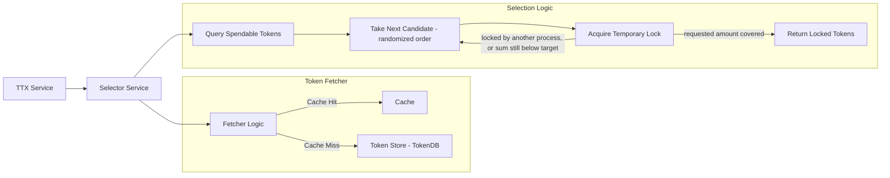

# Selector Service

The **Selector Service** (`token/services/selector`) picks the unspent tokens (UTXOs) that fund a transaction and holds them under a temporary lock while the transaction is assembled, so that concurrent transactions of the same wallet do not try to spend the same tokens.

## Core Responsibilities

The Selector Service is responsible for:
*   **UTXO Selection**: Finding a set of spendable tokens that cover the total quantity required for a transfer operation.
*   **Double-Spending Mitigation**: Temporarily locking selected tokens during the transaction assembly phase to prevent multiple concurrent transactions from attempting to spend the same tokens.
*   **Candidate Enumeration**: Walking the wallet's candidate tokens in randomized order, locking each one as it is encountered, and stopping as soon as the accumulated amount covers the request. Token amounts do not order or rank the candidates.

## Interaction with TTX and Storage

The Selector Service bridges the gap between the high-level **TTX Service** and the internal **TokenDB**.



**How the components interact:**
- **Selector Service**: Creates a selector instance per transaction and orchestrates the Selection Logic steps
- **Query Spendable Tokens**: Selector calls the Fetcher to retrieve available tokens
- **Fetcher Logic**: Checks cache first (fast path), queries Token Store - TokenDB on cache miss (slow path)
- **Take Next Candidate**: Selector takes the next token from the randomized candidate set; the token's amount plays no part in the choice
- **Acquire Temporary Lock**: Selector locks each candidate as it is encountered, before it knows whether the request can be covered at all; a candidate already locked by another process is skipped and the loop moves on

## Key Components

### Selector Manager
The `SelectorManager` is the entry point for obtaining a `Selector` instance anchored to a specific transaction. It ensures that the selection process is consistent and tied to the lifecycle of a single token request.

### Token Selection Algorithm

Selection is a **randomized greedy first-fit**. It is not configurable, and it is not
amount-aware. `Selector.selectInternal` (`token/services/selector/sherdlock/selector.go`)
does the following:

1. the candidate tokens of the wallet and token type are enumerated in randomized order,
2. each candidate is locked as it is encountered — a candidate already locked by another
   process is skipped; a lock failure wrapping `token.SelectorRateLimited` is a hard abort
   (not a skip),
3. the amounts of the successfully locked tokens are added up, and
4. the selector returns as soon as the running sum reaches the requested quantity.

A token's amount therefore only decides *when* the loop stops, never *which* candidate is
picked. Two consequences worth planning for:

*   **The number and size of the inputs is not minimized.** A request that a single large
    token could have covered may well be funded by several small ones.
*   **The result is not deterministic.** The same request against the same wallet can select
    a different set of tokens, and a different number of inputs, on each run.

**The randomization is deliberate.** It is what spreads concurrent selectors of the same
wallet across different candidates: walking a fixed order would make every selector contend
for the same first tokens, driving up lock failures and, with them, the immediate-retry path
that gives up with `token.SelectorSufficientButLockedFunds`, and beyond it the backoff path
that ends in `token.SelectorInsufficientFunds`.

The shuffle lives in the sherdlock fetcher, not in the selection loop
(`token/services/selector/sherdlock/fetcher.go`): the lazy fetcher wraps the database
iterator in `collections.NewPermutatedIterator`, and the cached fetcher hands out a fresh
permutation of the cached slice on every query. The `simple` driver does **not** shuffle — it
walks the database iterator in the order the token store returns it
(`token/services/selector/simple/selector.go`) — so concurrent selectors under `simple` are
more exposed to colliding on the same leading candidates.

**How it works in the flow (see "Selection Logic" subgraph in diagram):**
1. **TTX Request**: TTX Service requests token selection for a transfer operation
2. **Query Spendable Tokens**: Selector queries via Fetcher (Cache Hit → fast path, Cache Miss → Token Store - TokenDB)
3. **Take Next Candidate**: Selector takes the next token from the randomized candidate set
4. **Acquire Temporary Lock**: The candidate is locked to prevent double-spending (in the `TokenLocks` table under the `sherdlock` driver, in memory under `simple`); on success its amount is added to the running sum, on failure the loop moves to the next candidate
5. **Return or Retry**: The selector returns as soon as the sum covers the request; if the
   candidate set is exhausted while other processes hold locks, it retries in two distinct
   layers:
   - **Immediate-retry layer** (`sherdlock` only): the inner loop refetches — refreshing the
     sherdlock token cache via the fetcher — up to a hardcoded `maxImmediateRetries = 5` times
     without releasing its already-acquired locks, then gives up with
     `token.SelectorSufficientButLockedFunds`. Under `simple`, there is no equivalent cache
     layer; the outer retry loop re-queries the query service directly on every attempt.
   - **Backoff layer**: a configurable `numRetries` / `retryInterval` outer loop (the
     `StubbornSelector` wrapper in `sherdlock`; the `numRetry` / `timeout` loop in `simple`)
     releases locks, sleeps, and re-runs the whole selection from scratch. Exhausting this
     layer returns `token.SelectorInsufficientFunds`.

#### Strategies that are not implemented

Amount-aware strategies — smallest-first, largest-first, First-In-First-Out, or minimizing
the number of inputs — are **not** implemented and cannot be configured. There is no
strategy abstraction in the code and no configuration key that selects one. Making selection
amount-aware is tracked in
[issue #2017](https://github.com/LFDT-Panurus/panurus/issues/2017).

### Locking Mechanism
To prevent double-spending *before* the transaction is committed to the ledger, the Selector Service uses a local `TokenLocks` table in the **Storage Service** (see "TokenLocks" box in diagram above).

**Lock lifecycle:**
1.  **Lock Acquisition**: When the selector takes a candidate token, it attempts to insert a record in the `TokenLocks` table.
2.  **Concurrency Control**: If another concurrent process has already locked that token, the insertion fails, and the selector moves on to the next candidate.
3.  **Lock Release**: Locks are released either when the transaction reaches finality (success/failure) or when a timeout occurs, ensuring that tokens do not remain permanently inaccessible due to crashed or abandoned transactions.

### In-Memory Locker Internals

The `simple` driver keeps its locks in memory (`token/services/selector/simple/inmemory`)
instead of the `TokenLocks` table. Its state is sharded per owner (the wallet the tokens
are selected for): every owner has its own `shard`, holding that owner's locked tokens
behind its own mutex, and the shards themselves live in a registry map behind a second
mutex. Two owners therefore never serialize against each other, not even while a lock
attempt is waiting on a transaction-status lookup.

Two invariants keep the two mutex levels safe:

*   **Lock order is shard first, registry second.** The only place that takes the
    registry lock while holding a shard lock is the pruning of an empty shard, which must
    observe the shard as empty while holding it. Every operation that needs to walk all
    shards (`IsLocked`, `UnlockByTxID`, the background collector, the locked-token count)
    therefore snapshots the registry, releases the registry lock, and only then takes the
    individual shard locks. Taking the two in the opposite order deadlocks the locker.
*   **A pruned shard is never written to.** When a shard becomes empty it is removed from
    the registry and marked as pruned. A `Lock` that had already obtained that shard
    re-checks the mark under the shard lock and retries on the freshly registered shard,
    so a lock can never end up in a shard no other operation can reach. Pruning also
    removes the registry entry only if it still points at that exact shard, so a stale
    empty shard cannot evict a newer shard holding live locks.

The background collector (the goroutine that frees locks of finalized transactions) copies
a shard's entries, releases the shard lock, and only then looks the transaction statuses
up, so a slow status provider never blocks locking or unlocking. Because the shard is
unlocked in between, each entry is re-validated before removal — same transaction ID and
same last-access time — and entries that were reclaimed or re-accessed meanwhile are kept.

## Token Fetcher and Cache

The selector uses a **Token Fetcher** to retrieve available tokens from the database. The fetcher uses a **Ristretto LRU cache** to improve performance by caching token queries (keyed by wallet+currency).

**Flow**: `Selector.Select()` → `Fetcher.UnspentTokensIteratorBy(wallet, currency)` → `Token Iterator`

**How it works:**
1. Selector requests tokens from Fetcher for a specific wallet and currency
2. Fetcher checks its cache (keyed by wallet+currency)
3. If cache is fresh, returns cached tokens immediately (fast path)
4. If cache is stale, queries database and updates cache
5. Selector iterates through tokens, attempting to lock each one
6. If insufficient tokens, selector requests fresh data and retries

**Iterator lifecycle:** the iterator the fetcher hands out owns a resource — on the lazy
path it wraps the query's `sql.Rows`, and therefore a database cursor and its pooled
connection — so exactly one `Close()` per iterator is required. The selector holds at most
one iterator at a time: step 6 above closes the iterator it displaces before installing the
refreshed one, and `Selector.Close()` closes whichever is current. Both happen under the
selector's mutex, so closing a selector while a retry is in flight neither leaks an iterator
nor races with the retry.

**Adaptive refresh strategy** with two triggers:
- **Time-based**: Refreshes when data is older than `fetcherCacheRefresh`
- **Query-based**: Refreshes after `fetcherCacheMaxQueries` queries to prevent serving stale data in high-throughput scenarios

## Configuration

Configure the selector service in your `core.yaml`:

```yaml
token:
  selector:
    driver: sherdlock                    # Selector implementation and locking backend: sherdlock | simple (default: sherdlock)
    retryInterval: 5s                    # Wait time between retries (default: 5s)
    leaseExpiry: 3m                      # Lock expiration time (default: 3m)
    leaseCleanupTickPeriod: 1m           # Lock cleanup interval (default: 1m)
    fetcherCacheSize: 1000               # Cache size in entries (default: 0 = use fetcher default)
    fetcherCacheRefresh: 30s             # Cache refresh interval (default: 0 = use fetcher default)
    fetcherCacheMaxQueries: 100          # Max queries before cache refresh (default: 0 = use fetcher default)
    
    # Security: Resource limits to prevent algorithmic attacks
    limits:
      maxTokensPerSelection: 10000       # Max tokens to examine per selection (default: 10000)
      maxLockAttempts: 50000             # Max lock operations per selection (default: 50000)
      maxRetries: 3                     # Max retry cycles before giving up (default: 3)
      maxLocksPerTransaction: 5000       # Max concurrent locks per transaction (default: 5000)
      selectionTimeout: 30s              # Wall-clock timeout for selection (default: 30s)
```

### Driver

`driver` selects the selector implementation and, with it, the locking backend:

- **sherdlock** (default): locks in the `TokenLocks` table of the Storage Service, with
  leases governed by `leaseExpiry` and `leaseCleanupTickPeriod`.
- **simple**: keeps its locks in memory (see [In-Memory Locker Internals](#in-memory-locker-internals)).

It does **not** select a selection algorithm: both drivers walk candidates greedily and stop
on first cover, but they diverge in several ways beyond the shuffle:

- `sherdlock` randomizes the candidate order; `simple` walks tokens in database order.
- `sherdlock` holds already-acquired locks across immediate retries; `simple` releases all
  locks between every retry attempt.
- `simple` runs a `GetTokens` concurrency check after a successful cover and can return a
  fourth error sentinel, `token.SelectorSufficientFundsButConcurrencyIssue`, which
  `sherdlock` does not produce.

### Security Limits

The selector enforces hard resource limits to prevent denial-of-service attacks. See [Security: Selector Resource Limits](../security/selector_resource_limits.md) for detailed information on:

- Threat model and attack vectors
- Detailed explanation of each limit
- Configuration examples for different environments
- Monitoring and alerting guidance
- Operational procedures and tuning
- Plugging in your own per-wallet rate limiting via a custom `Locker`

**Important**: All limits are enforced by default with secure values. Review the security guide before adjusting limits in production.

### Cache Configuration

The fetcher cache improves performance by caching token queries:

- **fetcherCacheSize**: Maximum number of cached query results. Set to 0 to use the fetcher's default size.
- **fetcherCacheRefresh**: Time interval after which cached data is considered stale and refreshed. Set to 0 to use the fetcher's default interval.
- **fetcherCacheMaxQueries**: Maximum number of queries before forcing a cache refresh. Set to 0 to use the fetcher's default limit.

**Example**: With `fetcherCacheSize: 1000`, `fetcherCacheRefresh: 30s`, and `fetcherCacheMaxQueries: 100`, the cache stores up to 1000 query results, refreshes data every 30 seconds, and forces a refresh after 100 queries.
