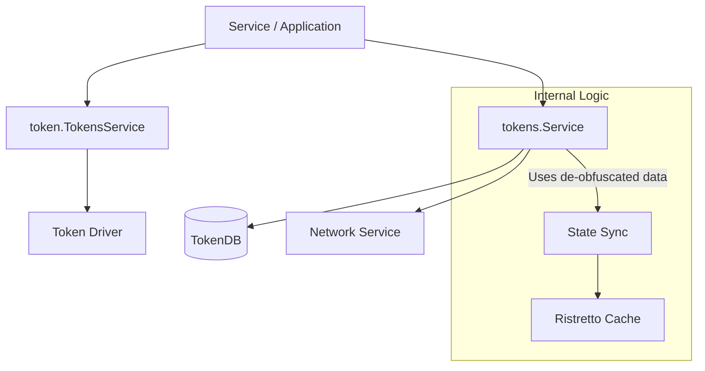

# Tokens Service

The **Tokens Service** provides advanced operations on tokens that extend beyond basic UTXO management. There are two primary layers: a high-level API for cryptographic de-obfuscation and an internal service for managing local state synchronization.

## Internal Service (`token/services/tokens`)

The internal [Service](../../token/services/tokens/tokens.go) is responsible for managing the local representation and lifecycle of tokens. It bridges the gap between ledger-level UTXOs and application-level wallet state.

### Core Responsibilities
*   **State Management**: Updating the local `TokenDB` to reflect the ledger's state (marking tokens as spendable, pending, or deleted). See [storage.go](../../token/services/tokens/storage.go).
*   **Typed Token Support**: Providing a unified way to handle multiple cryptographic token formats (e.g., cleartext vs. commitments) simultaneously via the [TypedToken](../../token/services/tokens/typed.go) structure.
*   **Lifecycle Monitoring**: Notifying local listeners (via `events.Publisher`) when tokens are added or removed, once the change has been committed. See [Event Publication and Transaction Boundaries](#event-publication-and-transaction-boundaries).
*   **Consistency**: Identifying and removing stale unspent tokens by cross-referencing local storage with the ledger via the [Network Service](../../token/services/network/network.go) (see `PruneInvalidUnspentTokens`).

### Marking Spent Tokens

`DBTransaction.DeleteToken` marks a spent token as deleted. Deletion is *idempotent*: a
token that is not present in the local store — the ordinary case for inputs that are not
mine, and for spent identifiers under graph hiding — is not an error, and no delete-token
event is published for it. A failure reported by the underlying store is always returned,
regardless of whether the token was found locally, so that a transaction is never recorded
as processed while its spends were not applied.

### Event Publication and Transaction Boundaries

The `store-token` (`tokens.AddToken`) and `delete-token` (`tokens.DeleteToken`) events are
published **only after the database transaction that produced them has been committed**. A
subscriber therefore never observes a token that is later rolled back and never persisted.

`DBTransaction.AppendToken` and `DBTransaction.DeleteToken` record their events on the
transaction — `DBTransaction.Notify` buffers, it does not publish — and:

*   `DBTransaction.Commit(ctx)` publishes them, and only if the commit succeeded. This covers
    the transactions the service owns, obtained from `DBStorage.NewTransaction`.
*   `DBTransaction.Rollback` discards them.
*   `DBTransaction.FlushEvents(ctx)` publishes them explicitly. It is used when the transaction
    is owned by the caller (`DBStorage.ContinueTransaction`), since the service is then not the
    one that decides whether the transaction is committed.

`Service.AppendValid` is the continued-transaction case: it applies a token request to a
transaction owned by the caller, and returns a `PostCommit` function alongside the error. The
caller must invoke it after its own commit succeeded, and must not invoke it when it rolls
back:

```go
tx, err := ttxDB.NewTransaction()
if err != nil {
    return errors.Wrapf(err, "failed creating new transaction [%s]", txID)
}
defer func() {
    if tx != nil {
        tx.Rollback()
    }
}()

publishTokenEvents, err := tokens.AppendValid(ctx, tx, token.RequestAnchor(txID), tr)
if err != nil {
    return errors.Wrapf(err, "failed to append valid token request [%s]", txID)
}
if err := tx.Commit(); err != nil {
    return errors.Wrapf(err, "failed commit [%s]", txID)
}
tx = nil

// the tokens are durably stored, so the events may now be observed
publishTokenEvents(ctx)
```

`PostCommit` is never nil, so it can be called unconditionally on the success path, and
calling it more than once publishes nothing further. The in-repo caller is the finality
listener, see [finality/listener.go](../../token/services/ttx/finality/listener.go).

### Delivery Guarantee: At-Most-Once

Token events (`store-token` / `delete-token`) are delivered **at most once** per
transaction, not at least once. This is an intentional trade-off introduced alongside the
`TransactionExists` idempotency guard in `AppendValid`.

**The failure window.** Consider the path through
[`finality/listener.go`](../../token/services/ttx/finality/listener.go):

1. `tx.Commit()` succeeds — tokens are now durable.
2. Before `publishTokenEvents(ctx)` is called, the process dies (or the connection that
   carries the commit acknowledgement resets), so no events are emitted for that run.
3. On the next pass — a `retryRunner` retry, or the recovery manager's
   [`TTXRecoveryHandler.Recover`](../../token/services/ttx/finality/recovery.go) sweep —
   `AppendValid` is called again for the same `txID`.
4. `TransactionExists` returns `true` (the tokens *are* in the store), so `AppendValid`
   returns `noPostCommit` immediately.
5. The `store-token` / `delete-token` events for that transaction are **never emitted**.

**In-repo impact.** The only in-repo subscriber of these events is the certifier's
[`CertificationClient`](../../token/services/certifier/interactive/client.go). It
self-heals at process start via `Scan()`, which iterates all unspent tokens in the vault
and requests certification for any that are not yet certified. A token that missed its
event therefore stays uncertified only until the next process restart.

**Third-party / external subscribers** receive no such recovery mechanism and will miss
the notification silently. Any subscriber that requires reliable delivery must either:

* poll / replay from the token store on startup (mirroring `Scan()`), or
* treat an absent event for a known-committed transaction as equivalent to the event
  having been received (i.e., tolerate silent gaps by checking the store directly).

**Why this is still the right direction.** The previous behaviour — emitting events for
transactions that were never committed — was strictly worse. The at-most-once semantics
are correct for the at-rest store: a subscriber can always verify the current state of a
token by querying `TokenDB` directly.

## Token Representations

Panurus supports multiple cryptographic representations simultaneously using Type IDs:

| Representation | Location | Type ID | Description |
| :--- | :--- | :--- | :--- |
| **Fabtoken** | [core/fabtoken](../../token/services/tokens/core/fabtoken/token.go) | `1` | **Cleartext**: Tokens where type, value, and owner are directly visible. |
| **Comm** | [core/comm](../../token/services/tokens/core/comm/token.go) | `2` | **Commitment**: Uses Pedersen commitments (`math.G1`) to hide details while maintaining provability. |

## De-obfuscation and High-Level API

While the internal service *manages* de-obfuscated state, the actual cryptographic "unscrambling" is handled by the [TokensService](../../token/tokens.go) interface (which wraps the underlying driver).

### The De-obfuscation Flow
Privacy-preserving drivers like `zkatdlog` hide token details on the ledger. To reveal them, the `Deobfuscate` method is used:
1.  **Input**: Obfuscated [TokenOutput](../../token/driver/tokens.go) and [TokenOutputMetadata](../../token/driver/tokens.go).
2.  **Process**: The driver uses the provided metadata (e.g., blinding factors, audit info) to recover the [token.Token](../../token/token/token.go) (Type and Quantity).
3.  **Output**: Cleartext token details, issuer identity, and recipient list.

This is critical for:
*   **Auditors**: Verifying transaction compliance without owning the tokens.
*   **Recipients**: Extracting the value of received tokens to update their local wallets.

## Implementation Details

*   **Management**: The [ServiceManager](../../token/services/tokens/manager.go) uses `lazy.Provider` for on-demand initialization per TMS.
*   **Caching**: A Ristretto-based `RequestsCache` stores pending requests and pre-extracted actions to optimize performance during transaction commitment.
*   **Storage**: Wraps the local `tokendb` implementation for persistent UTXO tracking.


