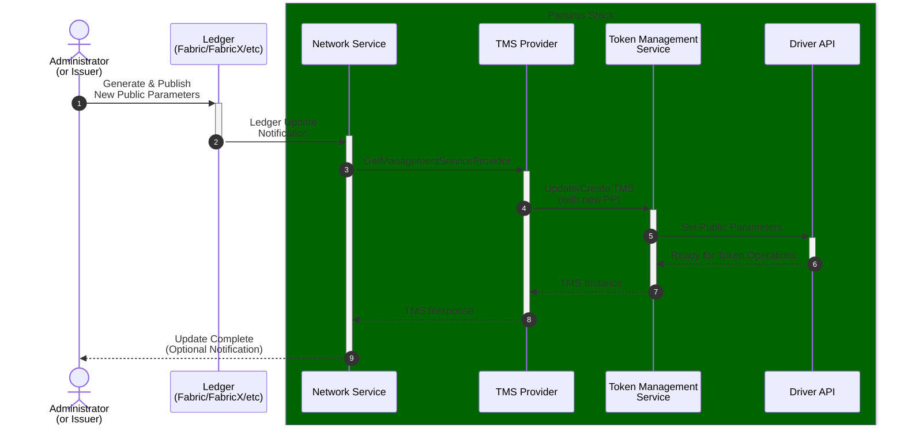

# Upgradability in Panurus

This document provides a comprehensive guide to upgrading components within a Panurus application. Upgradability is essential for long-term maintenance, allowing for security patches, feature additions, and protocol migrations.

Panurus manages upgradability at three distinct layers:
1.  **Ledger Layer**: Upgrading existing tokens to new formats.
2.  **Driver Layer**: Managing compatibility between Panurus and underlying token implementations.
3.  **Storage Layer**: Handling local database schema evolutions.

---

## Token Upgradability (Ledger)

Panurus manages token upgrades using two distinct mechanisms: the **Atomic "Burn and Re-issue" protocol** for across-format migrations and **In-place Upgrades** for backward-compatible transitions.

### In-Place Upgrades

In-place upgrades allow Panurus to spend tokens from a previous driver version or format (e.g., Fabtoken) directly as if they were native to the current driver (e.g., ZKAT-DLOG), without requiring an explicit ledger transaction first.

#### Criteria for In-Place Upgrades:
The current driver determines compatibility based on several criteria:
1.  **Format Support**: The token's format must be included in the driver's `SupportedTokenFormats()`.
2.  **Precision Compatibility**: For Fabtoken to DLog upgrades, the original token's precision must be less than or equal to the current driver's maximum supported precision (e.g., 64-bit).
3.  **Automatic Commitment**: When the driver encounters a compatible legacy token (like Fabtoken), it automatically generates a Pedersen commitment and an **Upgrade Witness**. This witness allows the new driver to prove the validity of the original token while treating it as a zero-knowledge commitment in the new transaction.

### The "Burn and Re-issue" Mechanism

When in-place upgrade is not possible (e.g., moving to a completely incompatible cryptographic curve or increasing precision beyond limits), Panurus implements an atomic "Burn and Re-issue" protocol.

Two disjoint families of formats reach this path:

*   **Fabtoken outputs above `maxPrecision`** — cleartext outputs whose value range the current driver cannot represent.
*   **ZKAT-DLOG outputs created under earlier public parameters** — see [Upgrading DLog tokens whose format changed](#upgrading-dlog-tokens-whose-format-changed) below.

> [!NOTE]
> **Eligibility is the complement of in-place support, by design.** For Fabtoken-to-DLog upgrades, a token's precision is either `<= maxPrecision` (in-place support, criterion 2 above — no issuer needed) or `> maxPrecision` (this path — issuer sign-off required because the value cannot be safely reinterpreted in a lower-precision format). These two ranges must never overlap: a driver that also accepted `<= maxPrecision` tokens into the Burn-and-Re-issue eligibility list would leave no token that ever needs this path, since every upgrade-eligible token would already be directly spendable. Whichever family a format belongs to, a format the driver already reports in `SupportedTokenFormats()` is always rejected here: burning a token that is perfectly spendable and minting a replacement would be pure loss. See the `Service` doc comment in `token/core/zkatdlog/nogh/v1/crypto/upgrade/service.go` for the implementation-level invariant.

#### Step-by-Step Flow:
1.  **Identification**: The owner identifies tokens that are no longer supported.
2.  **Challenge-Response**: The owner requests a "challenge" from an authorized issuer.
3.  **Proof Generation**: The owner generates an "upgrade proof" showing they own the old tokens and that the values match the intended new tokens.
4.  **Atomic Transaction**: The issuer verifies the proof and submits a transaction that consumes the old tokens and issues new ones.

### Upgrading DLog tokens whose format changed

A ZKAT-DLOG output is a Pedersen commitment, and its `token.Format` is a digest that covers the
Pedersen generators of the public parameters that produced it (`SupportedTokenFormat` in
`token/core/zkatdlog/nogh/v1/token/service.go`). Regenerating the public parameters with different
generators — or on a different curve — therefore **renames every token created before**: the driver
no longer lists those formats in `SupportedTokenFormats()`, transfers skip the tokens, and they show
up as unspendable even though they are perfectly safe and unspent on the ledger.

Such a token cannot be reinterpreted in place: its commitment only opens under the bases of the
generation that created it. It goes through the issuer-mediated path instead, and the issuer needs
those old bases to learn what to re-issue.

#### Protocol

1.  The owner lists its unsupported tokens (`UnsupportedTokensIteratorBy`). For a DLog token, the
    ledger entry it gets back carries both the **commitment** (`LedgerToken.Token`) and its
    **opening** — type, value, blinding factor — in `LedgerToken.TokenMetadata`.
2.  The owner resolves the **generation of public parameters** that produced the token's format by
    matching the format against the public parameters it has stored locally
    (`upgrade.PublicParamsHistory.ByFormat`), and puts that hash in the upgrade proof
    (`Proof.PublicParamsHashes`, one entry per token, empty for Fabtoken entries).
3.  The issuer looks the hash up in its own store (`PublicParamsByHash`), **re-checks that those
    public parameters actually generate the format the token was recorded with**, and only then
    opens the commitment with their Pedersen bases (`upgrade.PublicParamsHistory.ByHashAndFormat`
    followed by `Token.ToClear`). This recovers the type and the value to re-issue.
4.  The issuer assembles the usual upgrade transaction (`ttx.Transaction.Upgrade`). The ledger side
    is format-agnostic: the issue action's inputs must exist and are deleted atomically with the new
    issuance, so no old-format validation logic is needed on the ledger.

The declared hash is only a lookup hint that saves the issuer a scan — it is never trusted on its
own. Because the format digest is recomputed from the retrieved public parameters and compared with
the format recorded on the ledger, the only bases the issuer will ever use are the ones that
demonstrably produced that token; and because the opening must match the commitment, the owner
cannot inflate the type or the value it gets back.

#### Tracing a token back to its public parameters

Panurus records the public parameters in two places, and both matter for this flow:

*   **`PublicParams` table (TokenDB)** — every generation of public parameters the node ever
    observed. `StorePublicParams` never overwrites an existing row, so the table is a history, and
    `PublicParamsByHash` / `PublicParamsHashes` expose it (surfaced to drivers through
    `driver.QueryEngine`). This is what makes the upgrade possible at all.
*   **`Requests.pp_hash` (TTXDB / AuditDB)** — the hash of the public parameters in force when each
    transaction was recorded, i.e. a per-`txID` trace of which generation created a token.

> [!IMPORTANT]
> **The issuer must retain the old public parameters.** An issuer whose `PublicParams` table no
> longer holds the generation that created a token cannot open its commitment and will refuse the
> upgrade (`failed to resolve the public parameters of token …`). Never prune that table, and when
> rebuilding an issuer's TokenDB from scratch, re-import every historical public parameters version
> before running upgrades. A node that joined the network after a regeneration only has the
> generations published since it joined.

> [!WARNING]
> **Regenerate public parameters deliberately.** Since Pedersen generators are derived
> deterministically from the driver name, driver version and curve
> (`PublicParams.GeneratePedersenParameters`), re-running `tokengen` for the same driver, version and
> curve reproduces the same bases and therefore the same formats — no upgrade needed. Formats only
> change when the curve, the driver version, or the generation procedure itself changes. Before
> publishing new public parameters, compare `SupportedTokenFormats()` before and after: if the set
> changes, every existing token needs this upgrade path, and owners must be online to run it.

### Code Example: Identifying Unsupported Tokens

Developers can use the `tokens` service to find tokens that require an upgrade.

```go
// Get the tokens service for a specific TMS
tms, _ := token.GetManagementService(context, token.WithTMSID(myTMSID))
tokensService, _ := tokens.GetService(context, tms.ID())

// Iterate over tokens of type "USD" that the current driver cannot spend
it, err := tokensService.UnsupportedTokensIteratorBy(
    context.Context(), 
    myWalletID, 
    "USD",
)
if err != nil {
    return err
}
defer it.Close()

var toUpgrade []token.LedgerToken
for {
    tok, _ := it.Next()
    if tok == nil { break }
    toUpgrade = append(toUpgrade, *tok)
}
```

### Code Example: The Upgrade Transaction (Issuer Side)

The issuer uses the `ttx` package to wrap the upgrade logic.

```go
// Inside a Responder View
tx, err := ttx.NewTransaction(context, nil, ttx.WithTMSID(upgradeRequest.TMSID))

// The Upgrade call consumes old tokens and issues new ones in one atomic step
err = tx.Upgrade(
    context.Context(),
    issuerWallet,
    upgradeRequest.RecipientIdentity,
    upgradeRequest.Challenge,
    upgradeRequest.Tokens, // Old tokens from ledger
    upgradeRequest.Proof,  // ZK-Proof or Signature
)
```

### Recommendations for Token Upgrades
*   **Batching**: Upgrade tokens in batches (e.g., 10-20 at a time). Large upgrades can exceed the maximum transaction or block size limits of the underlying ledger (e.g., Fabric's 10MB limit).
*   **Offline Owners**: Owners must be online to initiate an upgrade. Consider providing a UI notification when "Unspendable" tokens are detected.
*   **Verification**: Always verify the `PublicParameters` of the new driver before initiating a mass upgrade to ensure the target format is correct.

---

## Driver Upgradability

Panurus handles driver transitions gracefully during its startup sequence.

### Automatic Spendability Management

When the `Token Management Service (TMS)` initializes, it performs a `PostInit` sequence. It compares the formats of all tokens in the local database against the `SupportedTokenFormats()` reported by the currently loaded driver.

*   **Unsupported Formats**: Tokens with formats not recognized by the driver are marked `spendable = false` in the local DB.
*   **Supported Formats**: Tokens matching the current driver are marked `spendable = true`.

### How Drivers Define Formats

Drivers like `fabtoken` or `zkatdlog` derive their format string from their `PublicParameters` (e.g., precision, identity types).

```go
// Example of how a driver might calculate its format
func SupportedTokenFormat(precision uint64) (token.Format, error) {
    hasher := sha256.New()
    hasher.Write([]byte("zkatdlog"))
    hasher.Write([]byte(fmt.Sprintf("%d", precision)))
    return token.Format(hex.EncodeToString(hasher.Sum(nil))), nil
}
```

For more information on how token formats are used in Panurus's token service, see the [Tokens Service documentation](./services/tokens.md).

### Public Parameters Upgrade Process

Panurus provides a structured approach for upgrading public parameters across the network. 
This process ensures that all participants can smoothly transition to new cryptographic parameters while maintaining compatibility.



#### Process Overview

1. **Generation**: New public parameters are created using tools like [tokengen](./development/tokengen.md) or custom processes
2. **Publishing**: Parameters are distributed to the network backend (for Fabric: via chaincode transactions or configuration updates)
3. **Detection**: The Network Service monitors the ledger for public parameter updates
4. **Fetching**: Panurus retrieves new parameters through the `PublicParamsFetcher` interface
5. **Update**: The `TokenManagerServiceProvider` compares new vs existing parameters and updates the TMS if changed
6. **Propagation**: All subsequent token operations use the upgraded public parameters

#### Verification

After the upgrade process completes, administrators can verify that all nodes are synchronized by retrieving the public parameters using the Token API's PublicParametersManager. This ensures that the new parameters have been successfully propagated throughout the network.

```go
// Get the TMS for verification
tms, err := token.GetManagementService(context, token.WithTMSID(myTMSID))
if err != nil {
    return err
}

// Get the Public Parameters Manager
ppm := tms.PublicParametersManager()

// Retrieve the current public parameters
currentPP := ppm.PublicParameters()
if currentPP == nil {
    return errors.New("public parameters not available")
}

// Verify the parameters match the expected values
// (Implementation-specific validation would go here)
```

#### Key References

- See [Public Parameters Documentation](./public_parameters.md) for PP structure details
- See [Driver API](./driverapi.md) for driver-PP interaction mechanisms
- See [Tokens Service](./services/tokens.md) for how tokens service utilizes PP

### Recommendations for Driver Upgrades
*   **Side-by-Side Migration**: If possible, deploy the new driver version on a subset of nodes first to verify transaction validation before a full network rollout.
*   **Monitor "Spendable" Balance**: Use the `Balance` API to monitor the ratio of spendable vs. unspendable tokens. A sudden drop in spendable balance indicates a driver mismatch.

---

## Storage DB Schema Upgradability

The local storage (SQL) uses a "Lazy Creation" strategy.

### Table Initialization logic

Panurus uses `CREATE TABLE IF NOT EXISTS`. This handles fresh installs perfectly but does not manage `ALTER TABLE` operations for existing databases.

```sql
-- Panurus executes this on startup
CREATE TABLE IF NOT EXISTS fsc_tokens (
    tx_id TEXT NOT NULL,
    idx INT NOT NULL,
    -- ... other columns
    ledger_type TEXT DEFAULT '', -- New columns added in SDK updates
    PRIMARY KEY (tx_id, idx)
);
```

### Handling Schema Changes

If a new version of Panurus adds a column (e.g., `ledger_metadata` or `spent_at`), the `IF NOT EXISTS` clause will prevent the new schema from being applied to an existing table.

### Recommendations for Schema Migrations
1.  **Manual SQL Scripts**: For production systems, maintain a set of SQL migration scripts. Before starting the updated SDK, run:
    ```sql
    ALTER TABLE fsc_tokens ADD COLUMN IF NOT EXISTS ledger_metadata BYTEA;
    ```
2.  **Vault Re-scan**: For non-critical nodes or during development, you can simply delete the local database file (e.g., `vault.db`). Panurus's `Vault` service can re-sync its state by scanning the ledger, though this may take time depending on the ledger size.
3.  **Check Release Notes**: Always check Panurus release notes for "Database Schema Changes" which will list any required manual `ALTER` statements.

> [!WARNING]
> **Breaking change**: the `Tokens` table (`fsc_tokens`) gained a new `redeemed BOOL NOT NULL DEFAULT false` column, and all `INSERT`/`SELECT` statements against this table were updated accordingly (see `IssuedBalance`/`RedeemedBalance` in [Issuer Wallet](tokenapi.md#wallet-manager)). Existing deployments **must** apply this migration before upgrading, otherwise the SDK's `INSERT INTO fsc_tokens (..., redeemed)` statements will fail against the old schema:
> ```sql
> ALTER TABLE fsc_tokens ADD COLUMN IF NOT EXISTS redeemed BOOL NOT NULL DEFAULT false;
> ```
> Any node that also stores tokens locally (e.g. an issuer that is also an owner or auditor) needs this migration applied to its `TokenDB` before upgrading.

### Database Schema Changes: `Wallets` / `IdentityConfigurations` linkage

Panurus links every `Wallets` row to the `IdentityConfigurations` row it originated
from via a `conf_id` column: `IdentityConfigurations.conf_id` is a deterministic hash
of `(id, type, url)` (see `IdentityConfiguration.UniqueID()`), declared `UNIQUE NOT
NULL`, and `Wallets.conf_id` is a hard `FOREIGN KEY` reference to it, also `NOT NULL`.

Because Panurus only ever runs `CREATE TABLE IF NOT EXISTS`, existing databases
created before this change will not get these columns automatically. Before starting
an updated SDK against an existing database, migrate manually:

```sql
-- 1. Add the column to IdentityConfigurations first (FK target).
ALTER TABLE fsc_identity_configurations ADD COLUMN IF NOT EXISTS conf_id TEXT;
-- Backfill: conf_id = base64(sha256(id || '@' || type || '@' || url)), matching
-- IdentityConfiguration.UniqueID(). Run this from application code (or a one-off
-- script using the same hash function) rather than in pure SQL.
ALTER TABLE fsc_identity_configurations ALTER COLUMN conf_id SET NOT NULL;
ALTER TABLE fsc_identity_configurations ADD CONSTRAINT uq_identity_configurations_conf_id UNIQUE (conf_id);

-- 2. Add the column to Wallets and backfill it from the matching configuration
--    (join on however the wallet's owning configuration is known, e.g. wallet_id/id).
ALTER TABLE fsc_wallets ADD COLUMN IF NOT EXISTS conf_id TEXT;
-- Backfill fsc_wallets.conf_id from fsc_identity_configurations.conf_id here.
ALTER TABLE fsc_wallets ALTER COLUMN conf_id SET NOT NULL;
ALTER TABLE fsc_wallets ADD CONSTRAINT fk_wallets_conf_id
    FOREIGN KEY (conf_id) REFERENCES fsc_identity_configurations (conf_id);
```

On SQLite, use the `ALTER TABLE ... ADD COLUMN` form (SQLite cannot add a `NOT NULL`
column without a default or a FK constraint in one statement) — add the columns
nullable, backfill, then rebuild the table (`CREATE TABLE ... AS SELECT` + rename) to
add the `NOT NULL` and `FOREIGN KEY` constraints, since SQLite does not support adding
constraints via `ALTER TABLE` after the fact.

### Database Schema Changes: `Requests` recovery-claim columns

The [Transaction Recovery Service](services/storage/recovery.md) added two nullable
columns to the `Requests` table (`fsc_requests`), used to lease pending transactions
to a claiming instance: `recovery_claimed_by TEXT` and `recovery_claim_expires_at
TIMESTAMP`, plus a partial index on `(status, recovery_claim_expires_at, stored_at)
WHERE status = 1`. Since both columns are nullable, this is a non-breaking change —
existing rows are simply treated as unclaimed — but `CREATE TABLE IF NOT EXISTS` still
will not add them to a pre-existing table, so recovery will fail to claim transactions
until the columns exist. Migrate manually before upgrading:

```sql
ALTER TABLE fsc_requests ADD COLUMN IF NOT EXISTS recovery_claimed_by TEXT;
ALTER TABLE fsc_requests ADD COLUMN IF NOT EXISTS recovery_claim_expires_at TIMESTAMP;
CREATE INDEX IF NOT EXISTS idx_recovery_claim_fsc_requests
    ON fsc_requests (status, recovery_claim_expires_at, stored_at) WHERE status = 1;
```

This table is shared by `TTXDB`, `AuditDB`, and `TokenDB` (each defines the same
`CREATE TABLE IF NOT EXISTS` for `Requests`), so the migration only needs to run once
against the physical table they share.

---

## Serialization and Protocol Stability

Panurus relies heavily on **Protocol Buffers (Protobuf)** for serializing all core objects, including Public Parameters, Token Requests, and individual Actions. This choice is fundamental to Panurus's ability to evolve over time while maintaining compatibility between nodes running different software versions.

### The Role of Protobuf in Upgradability

Protobuf provides a binary serialization format that is both efficient and highly extensible. Panurus leverages several Protobuf features to ensure long-term stability:

1.  **Field Numbering and Compatibility**: 
    - **Backward Compatibility**: Newer versions of Panurus can add new fields to messages (e.g., adding an optional `Priority` field to a `TokenRequest`). Older nodes receiving these messages will simply ignore the unknown fields and continue processing the data they recognize.
    - **Forward Compatibility**: Newer nodes can receive messages from older nodes. Any missing fields in the older message are assigned their default values (e.g., `0` for integers, `""` for strings), allowing the new logic to handle them gracefully.

2.  **Opaque "Raw" Envelopes**: 
    Panurus uses a "wrapper" pattern for driver-specific data. For example, the `PublicParameters` message at the driver API level looks like this:
    ```protobuf
    message PublicParameters {
      string identifier = 1; // e.g., "zkatdlognogh/v1"
      bytes raw = 2;        // Opaque driver-specific bytes
    }
    ```
    This allows the core SDK to handle the delivery and storage of public parameters without needing to understand their internal structure. The `raw` bytes are only unmarshalled by the specific driver version identified by the `identifier`.

For more details on the specific Protobuf messages used by each driver, see:
- [**FabToken Protobuf Messages**](drivers/fabtoken.md#protobuf-messages)
- [**DLog (NOGH) Protobuf Messages**](drivers/dlogwogh.md#107-protobuf-message-definitions)

3.  **Extensible Metadata**: 
    Most core messages (like `IssueMetadata` or `PublicParameters`) include a `map<string, bytes> extra_data` or `application` field. This allows developers to attach arbitrary information to transactions or configurations without modifying the underlying `.proto` definitions, avoiding the need for a full protocol migration for application-specific changes.

### Recommendations for Protocol Changes
*   **Never Reuse Field Numbers**: Once a field number is assigned in a `.proto` file, it must never be reassigned to a different field, even if the original field is deprecated.
*   **Prefer Optional Fields**: Use `proto3` defaults or explicitly check for presence to ensure that missing fields from older clients don't cause crashes.
*   **Versioned Packages**: For major, breaking changes in a driver's internal logic, create a new protobuf package (e.g., `package zkatdlognogh.v2;`). This allows both the old and new unmarshallers to coexist in the same codebase.

---

## Summary of Upgradability Responsibilities

| Component | Responsibility | Mechanism |
| :--- | :--- | :--- |
| **Tokens** | Owner / Issuer | `ttx.Transaction.Upgrade` (Burn & Re-issue) |
| **Driver** | Admin / SDK | `PostInit` (Automatic Spendability Toggle) |
| **Schema** | Developer / Admin | Manual SQL `ALTER` or Database Re-sync |
